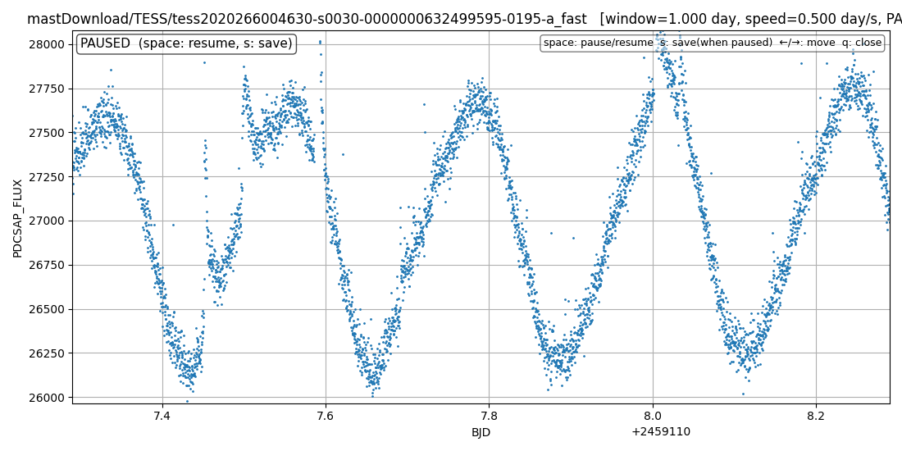

# qltess
天体名からTESSの測光データを探してダウンロードし、光度曲線を表示し、自動でスクロールする。古いql_tesslcの更新版

読み方は「キューエルテス」くらいでしょうか。

## 何が新しくなったか
　一番の違いは、OS非依存にしたことで、Linux / macOS / Windows（PowerShell）すべてで同じ動作になるはずです。(私はMacを持っていないためにMacでは未確認ですが、不具合があればご連絡ください)
  
 次に、データを保存するディレクトリが、カレントディレクトリ（実行したディレクトリなので不定）から~/tess_data/（固定）になりました。これにより、どのディレクトリで実行してもデータが保存される場所は１箇所になり集中管理できるようになりました。

 最後の違いは、後述のように以前は独立したコードのplot_lcfits.pyは廃止し、qltess.pyに統合しました。オプションで利用できます。
 
 
## 最も簡単な使い方（変光星名 UV Cet の例）
```
 python3 qltess.py "UV Cet"
```
または、_(アンダースコア)を利用して星名中にスペース文字が入らないようにすれば、全体を""でくくる必要がなくなります。また大文字小文字も無視されます。おすすめは全小文字＋アンダースコアで、次のよう入力が楽になります。
```
 python3 qltess.py uv_cet
```
 Windowsの場合は、コマンドプロンプトよりもWindows Power Shellで実行することをおすすめします。

表示された光度曲線のある場面（スペースキーを押せばスキャンが止まる）。複数のフレアが出現しているのがわかる。



[実行例：自動スクロールする様子の動画:YouTube](https://www.youtube.com/watch?v=tNV-A5AJE_U)

# オプションの使い方

オプションの -h をつけると日本語の説明が表示されます。
（”qltess.py”が~/python_prog/tess/ディレクトリに置いてある場合）

```
$ python3 ~/python_prog/tess/qltess.py -h
usage: qltess.py [-h] [-f] [-s SPEED] [-w WINDOW] [--intermittent]
                 [--save-dir SAVE_DIR] [--redownload] [--data-dir DATA_DIR]
                 target
TESS lc.fits quick-look downloader + scanner

positional arguments:
  target               TIC番号またはSIMBAD名。例: 11480757 または "AM Leo"

options:
  -h, --help           show this help message and exit
  -f, --full           全範囲の光度曲線を一度に表示する
  -s, --speed SPEED    スキャン速度 [day/sec] (default: 0.5)
  -w, --window WINDOW  表示窓幅 [day] (default: 1.0)
  --intermittent       間欠表示モード (0.5秒ごとに進める)
  --save-dir SAVE_DIR  sキーで保存するPNGの保存先ディレクトリ (default: snapshots)
  --redownload         既存ローカルファイルがあっても再ダウンロードする
  --data-dir DATA_DIR  データ保存ディレクトリ (default: ~/tess_data)


```

# 必要なpythonライブラリ

numpy, matplotlib, astropy, astroquery, lightkurve 

入っていなければ、次のようにpipでインストールできる。

```
pip install numpy matplotlib astropy astroquery lightkurve
```

# 実行するディレクトリ（フォルダー）
qltess.pyを実行すると、自動でダウンロードされた TESSの*_lc.fitsファイルは、 ~/tess_data/ディレクトリに保存される。
Windows PowerShellの場合は、C:\Users\YourName\tess_data\ になる。

後述の name2tic.py を実行すればそのディレクトリを表示してくれます。

# 実行例（Linux, "qltess.py"は~/python_prog/tess/に置いてある場合）
```
$ python3 ~/python_prog/tess/qltess.py yz_cmi

[INFO] input interpreted as SIMBAD object name: yz_cmi
[INFO] resolved TIC: 266744225
[INFO] TIC was resolved directly from SIMBAD identifiers.
[INFO] target: TIC 266744225
[INFO] download dir: /home/o2/tess_data/TIC266744225
[INFO] author=SPOC: 5 entries found
[INFO] author=SPOC: downloaded 5 files
[INFO] author=TESS-SPOC: 2 entries found
[INFO] author=TESS-SPOC: downloaded 2 files
[INFO] author=QLP: 3 entries found
[INFO] author=QLP: downloaded 3 files
[INFO] total downloaded entries: 10
[INFO] usable lc.fits files: 10

表示する lcfits を選んでください
--------------------------------------------------
  1 : mastDownload/HLSP/hlsp_qlp_tess_ffi_s0007-0000000266744225_tess_v01_llc
  2 : mastDownload/HLSP/hlsp_qlp_tess_ffi_s0034-0000000266744225_tess_v01_llc
  3 : mastDownload/HLSP/hlsp_qlp_tess_ffi_s0088-0000000266744225_tess_v01_llc
  4 : mastDownload/HLSP/hlsp_tess-spoc_tess_phot_0000000266744225-s0007_tess_v1_tp
  5 : mastDownload/HLSP/hlsp_tess-spoc_tess_phot_0000000266744225-s0034_tess_v1_tp
  6 : mastDownload/TESS/tess2019006130736-s0007-0000000266744225-0131-s
  7 : mastDownload/TESS/tess2021014023720-s0034-0000000266744225-0204-a_fast
  8 : mastDownload/TESS/tess2021014023720-s0034-0000000266744225-0204-s
  9 : mastDownload/TESS/tess2025014115807-s0088-0000000266744225-0285-a_fast
 10 : mastDownload/TESS/tess2025014115807-s0088-0000000266744225-0285-s
  q : 終了
--------------------------------------------------
選択番号または q を入力してください: 9
```
以上を実行した時の様子


# 少し詳しく光度曲線を見たい時は、 -f オプションを使う
(以前のplot_lcfits.pyは廃止しました。以下の説明のようにqltess.pyに統合ずみです。)

先に一度ql_tesslcを使ったら、その星のlcfitsファイルはすでに手元にダウンロードされています。
じっくりとその光度曲線を調べてみたいと思ったら、今度は -f オプションを付けて再度"qltess.py"を使えば、
全観測期間一括で光度曲線を表示してくれます。

特定の期間だけ表示させたい時は、最後に示すように虫めがねアイコンを使う方法があります。
```
$ python3 ~/python_prog/tess/qltess.py yz_cmi -f
[INFO] input interpreted as SIMBAD object name: yz_cmi
[INFO] resolved TIC: 266744225
[INFO] TIC was resolved directly from SIMBAD identifiers.
[INFO] local lc.fits files found: 10
[INFO] 既存のローカルデータを使用します: /home/o2/tess_data/TIC266744225
[INFO] usable lc.fits files: 10

表示する lcfits を選んでください
--------------------------------------------------
  1 : mastDownload/HLSP/hlsp_qlp_tess_ffi_s0007-0000000266744225_tess_v01_llc
  2 : mastDownload/HLSP/hlsp_qlp_tess_ffi_s0034-0000000266744225_tess_v01_llc
  3 : mastDownload/HLSP/hlsp_qlp_tess_ffi_s0088-0000000266744225_tess_v01_llc
  4 : mastDownload/HLSP/hlsp_tess-spoc_tess_phot_0000000266744225-s0007_tess_v1_tp
  5 : mastDownload/HLSP/hlsp_tess-spoc_tess_phot_0000000266744225-s0034_tess_v1_tp
  6 : mastDownload/TESS/tess2019006130736-s0007-0000000266744225-0131-s
  7 : mastDownload/TESS/tess2021014023720-s0034-0000000266744225-0204-a_fast
  8 : mastDownload/TESS/tess2021014023720-s0034-0000000266744225-0204-s
  9 : mastDownload/TESS/tess2025014115807-s0088-0000000266744225-0285-a_fast
 10 : mastDownload/TESS/tess2025014115807-s0088-0000000266744225-0285-s
  q : 終了
--------------------------------------------------
選択番号または q を入力してください: 9
```

ものすごいフレアの嵐ですね！

このグラフは、虫めがねアイコンをクリックして、マウスで範囲を指定すれば、自由に拡大できます。
元のスケールに戻したい時は、家マークのアイコンをクリック。

# name2tic.py
先に一度ql_tesslcを使ったら、その星のlcfitsファイルはすでに手元にダウンロードされています。
次にじっくりとそのデータファイルを調べてみたいと思ったら、収められているディレクトリをTIC番号で探さなければならない。
しかしTIC番号で探すのは、桁数が多く不便なので、このソフトを作りました。Linux / macOS / Windows(PowerShellから使うのがおすすめ)どれでもOKのはずです。

変光星名などのSIMBAD名を引数として与えれば、TIC番号が表示され、さらにその星のディレクトリがある場所を探し出してフルパス表示してくれます。

```
$ python3 ~/python_prog/tess/name2tic.py yz_cmi
TIC 266744225
Found directories:
/home/o2/tess_data/TIC266744225

```

